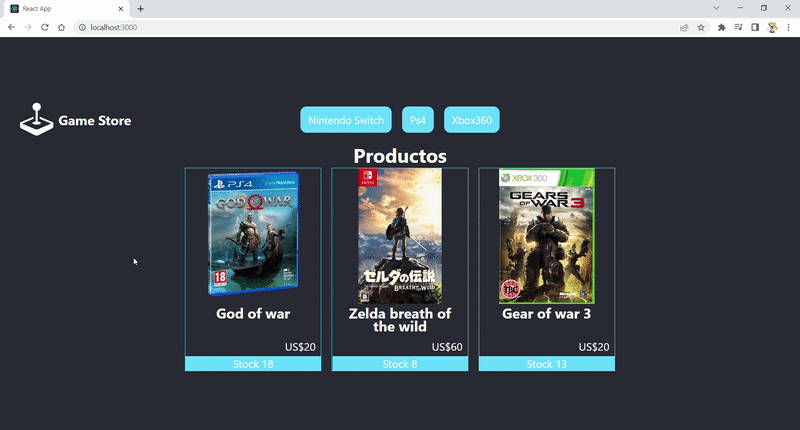

# Ecomerce practica

Proyecto desarrollado en el curso de React CoderHouse

Es un Ecomerce que muestra productos, se puede visualizar por detalle o categoria. Se puede agregar productos al carrito de compra y finalizar una compra

## Como ejecutar el proyecto

0) instalar node.js version 16.14.0 npm 8.3.1

1) Clonar repositorio.
    En la carpeta donde quieras clonar el proyecto abre un terminal
    En la terminal ejecuta
        git clone https://github.com/SCONsilvia/proyecto-coder-react.git
2) Hacer npm install
    npm install
3) hacer npm start
    npm start

## Librerias extras instaladas 

react-router-dom Para hacer las rutas y navegabilidad de la pagina
react-icons Permite usar los iconos de https://react-icons.github.io/react-icons
firebase para usar la base de datos que nos propociona firebase

## Base de datos usada

Firebase

## Rutas del proyecto

Ruta principal "/" Para acceder a esto debes dar click en el logo 
Ruta categoria "/category/<categoryId>" Para acceder a esto debes dar click en algunas de las categorias
Ruta detail "/detail/<productId>" Para acceder a esto debes dar click en uno de los productos
Ruta carrito "/cart" Para acceder a esto debes dar click en el carrito o en terminar compra cuando estes en el detalle del producto, el icono del carrito solo aparece cuando tienes algo agregado al carrito.
Ruta finalizar compra "/checkout" Para acceder a esto debes tener productos en el carrito ir al carrito y dar click al boton finalizar compra eso te llevara al formulario de compra
